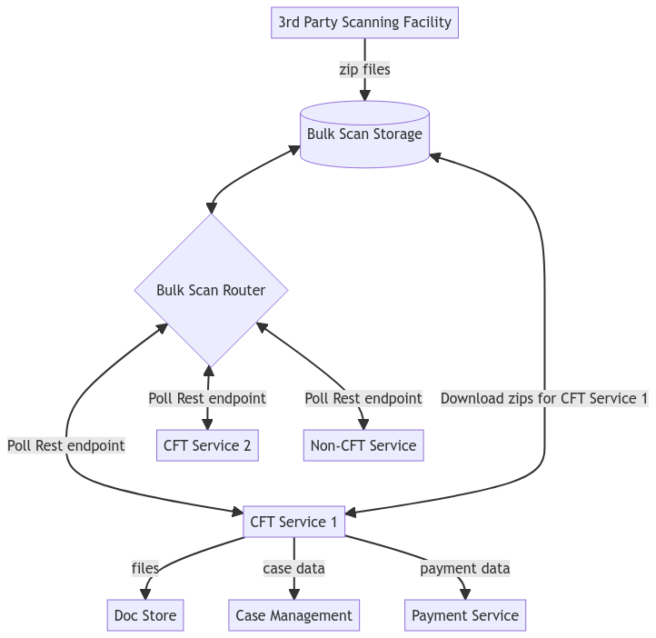

# bulk-scan-java-client

## Requirements
This prototype requires Java 17 as a minimum

## Installation
add the following to your build.gradle file
```
implementation group: 'com.github.hmcts', name: 'bulk-scan-java-client', version: '0.1.6'
```

An example upgrade from the existing Bulk Scan Integration to using this library can be found here: https://github.com/hmcts/probate-back-office/compare/master...DTSSE-1943/bulk-scan-poc

## Design


The main difference between the existing integration and using this library is that clients of Bulk Scan are now 
responsible for pulling their data from Bulk Scan instead of Bulk Scan orchestrating the entire journey on behalf of the
service teams.

Within this new client library exists the code which previously resided in the various Bulk Scan services. It includes:
1. An interface to process scanned files
2. Code to validate and unzip scanned files
3. Code to poll the Bulk Scan service for new scans for this client
4. An interface to perform OCR validation
5. Code to handle errors and exceptions
6. Code to update the audit trail of a scan with Bulk Scan
7. Code to handle scans with payment records
8. Code to get case details from a scanned document

What this library does not contain is:

1. Code to upload / save a document else where
2. Code to talk to CCD
3. Code to talk to IdAM